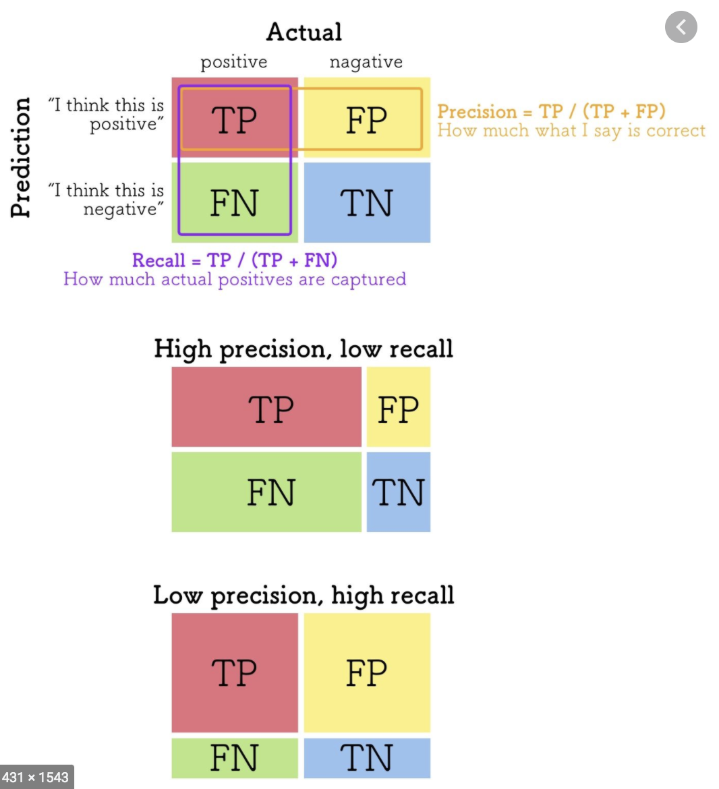

# Classification Problem : Breast Cancer Prediction (Benign or Malign) 

# About Tumors
- Tumors are abnormal growths in your body. They are made up of extra cells. Normally, cells grow and divide to form new cells as your body needs them. When cells grow old, they die, and new cells take their place. Sometimes, this process goes wrong. New cells form when your body does not need them, and old cells do not die when they should. When these extra cells form a mass, it is called a tumor.

- Tumors can be either benign or malignant. Benign tumors aren't cancer. Malignant ones are. Benign tumors grow only in one place. They cannot spread or invade other parts of your body. Even so, they can be dangerous if they press on vital organs, such as your brain.

## key differences between benign and malignant tumors?

## Dataset

#### General Information
- Data format: .csv
- Data shape : 569 x 33 (row x columns)

#### Features Information

For each sample, 10 properties were measured:

<ol>
    <li><b>Radius</b> - Mean distances from center to points on the perimeter</li>
    <li><b>Texture</b> - Standard deviation of gray scale values</li>
    <li><b>Perimeter</b></li>
    <li><b>Area</b></li>
    <li><b>Smoothness</b> - Local variation in radius lengths</li>
    <li><b>Compactness</b> - Perimeter^2/Area - 1</li>
    <li><b>Concavity</b> - Severity of concave portions of the contour</li>
    <li><b>Concave points</b> - Number of concave portions of the contour</li>
    <li><b>Symmetry</b></li>
    <li><b>Fractal Dimension</b> - Coastline approximation - 1 </li>
</ol>

For each property, 3 calcualted values have been provided in the dataset.
- **Mean**
- **Standard Error**
- **Worst** (Average of the 3 largest values)

#### Target

Target column is categorical column with values as 'B' (Benign) and 'M' (Malignant)  

## Problem Solving Approach

This dataset contains information on 569 breast tumors and the mean, standard error and worst measures for 10 different properties. I start with an EDA analysing each properties' distribution, followed by the pair interactions and then the correlations with our target.

After the EDA I set up 8 different models for a first evaluation and use stratified cross-validation to measure them. I use **Recall** instead of **Accuracy or F1-Score** since I want to detect all malignant tumors. 

After the first round of modeling, I have analyzed features importances and have done single round of feature selection and evaluated the models again. At the end, I analyzed model errors from the 8 first models and I have chose 2 models for fine tuning: 
**Logistic Regression, SVC**

Then I proceed to tune the top 2 models using **GridSearchCV** and prepare the data for model by predicting probabilities for both train and test sets.

## Model Evaluation

### Choosing the Proper Measure to Evaluate the Model Performance
There are **a lot** of ways to measure the quality of your model and so measure of performance must be chosen correctly.

Here our objective isn't classifying correctly the tumors but to accurately detect malignant tumors. Even though, we are trying to classify, cost of classifying a malignant tumor as benign is more. so,we would go with **RECALL** not **ACCURACY** because accuracy is all out pecent of predicting classes into right categories only.

Recall answers the following question: *from all the malignant tumors in our data, how many did we catch?*. Recall is calculated by dividing the True positives by the total number of positives (positive = malignant). It is important to realize that a high Recall doesn't mean a high Accuracy and there is often a trade-off between different performance measures. 

That said, we will be making our decisions based on Recall but we will also measure Accuracy to see the difference between them. 

### Coding Explanation:

The code on the cell below does the following steps:
* Setting up:
    1. Creates an array to store the out-of-fold predictions that we will use later on. Its shape is the training size by the number of models we have;
    2. Creates a list to store the Accuracy and Recall scores
* Outer Loop: Iterating through Models
    1. Creates a data pipeline with the scaler and the model
    - Creates two arrays to store each fold's accuracy and recall
    - Executes the inner loop
    - By the end of the cross-validation, stores the mean and the standard deviation for those two measures in the scores list
* Inner Loop: Cross-Validation
    1. Splits the training data into train/validation data
    2. Fits the model with the CV training data and predicts the validation data
    3. Stores the out-of-fold predictions (which is the validation predictions) in oof_preds
    4. Measures the Accuracy and Recall for the fold and stores in an array
    
## Summary - Insights from the results 

* Logistic Regression on training data
    - Accuracy:  99.5%     
    - Recall: 98.65%

* Logistic Regression on testing data
    - Accuracy:  94.15%     
    - Recall: 92.19%

* SVC on training data
    - Accuracy:  99.5%     
    - Recall: 98.65%

* SVC on testing data
    - Accuracy:  95.91%     
    - Recall: 93.75%
    
* Both models got at least 92% recall - for this data this means 5 malignant tumors not detected
* Best model SVC performed the best, with **93.75%** malgiinant tumors detected.

    
